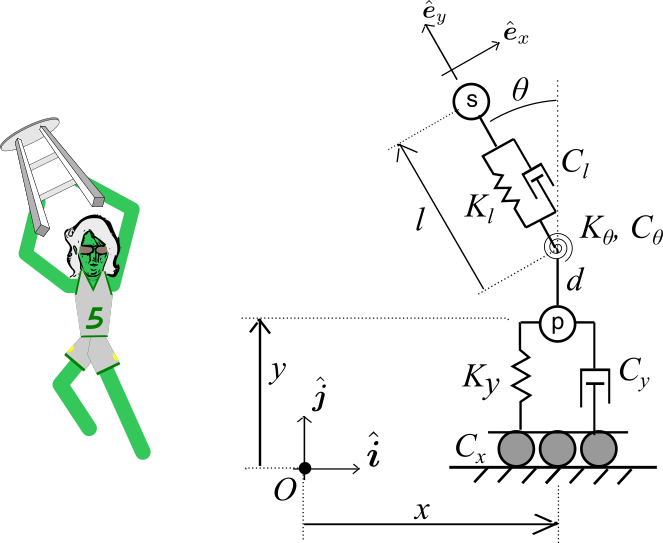

# dRuBbLe

A Silly Game With Silly Stools!

## How to play:

There are two virtual sticks which appear as crosshairs on the screen. 
Touch the stick on the lower left to move the stool. 
Touch the stick on the lower right to move the player.
The "Options" button in the upper left will return to the game selection screen.
Your goal is to bounce the ball off the top of your stool, as far and as high as possible. 
There are sub-variations on the game, "Single dRuBbLe," and "Double dRuBbLe."

When you start the game, you will do the following:
0. The ball starts on the ground. Press the "Begin" button in the upper right.
1. A line will appear showing a trajectory the ball may take depending on its initial angle and speed. Press the "Set Angle" button to select the initial angle (higher is usually better). After the angle is set, press the "Set Speed" button (faster!).
2. The ball will be launched. Your new goal is to bounce the ball off of the top of your stool, as many times, as far, and as high as possible.

There are two game modes, with a third and fourth planned:
### Single dRuBbLe
Throw it up, bounce it on the stool, try to keep it bouncing.

### Double dRuBbLe
First person throws it, second person tries to bounce it as far as they can on the stool.

### Triple dRuBbLe (Planned)
First person throws it, second person bounces it to the third person, who bounces it to the first person who has run behind them.

### Volley dRuBbLe (Planned)
First person bounces it over the center barrier, second person attempts to return it.
The round ends when either player can no longer return the ball, at which time the last player to hit the ball over the barrier earns a point.
Bounces are unlimited, and bounces of the ground are allowed.

## The History of dRuBbLe
A game we used to play while drinking in college.

## Dynamics Model
The player is modeled as a mass that is allowed to translate in the horizontal *x* and vertical *y* directions. 
A spring and damper attach the player to the ground in the *y* coordinate.
The stool is modeled as a point mass that is first offset vertically from the player mass by a distance *d*, then radially from this offset point by an additional distance *l*, where the rotation of the offset relative to the vertical axis is given by the angle $\theta$.
Given the description above, the dynamics are represented by a 4 degree-of-freedom 4-DOF system where the generalized coordinates are **q** = (*x*, *y*, *l*, *$\theta$*), which is visually represented in Figure 1.

**Figure 1 - Dynamics Model Diagram**

## Task List 
### Before Release
- [x] Move sticks and buttons out of the way so I can add a banner ad on the high score screen
- [x] Fix the computer player control
- [ ] Put in limits for the states to prevent crashing
- [ ] Add a tutorial
- [ ] Add audio for setting ball speed, button presses
- [ ] Add a background screen connecting the last screen to the first, geographically
- [ ] Add one more base audio file

### Future
- [ ] Add a VolleyDrubble sub-game
- [ ] Add a Triple Drubble sub-game
- [ ] Include a banner ad
- [ ] Add networked multiplayer mode
- [ ] Create a ball cannon
